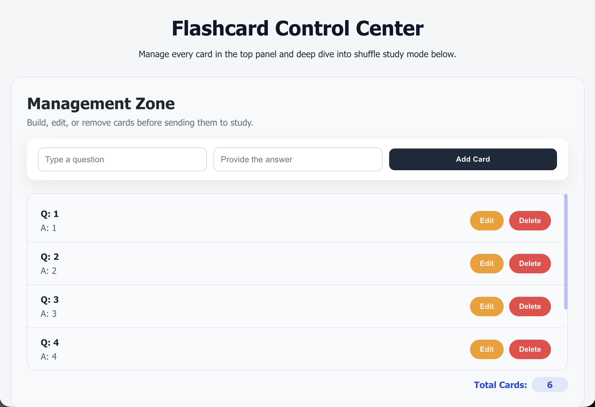
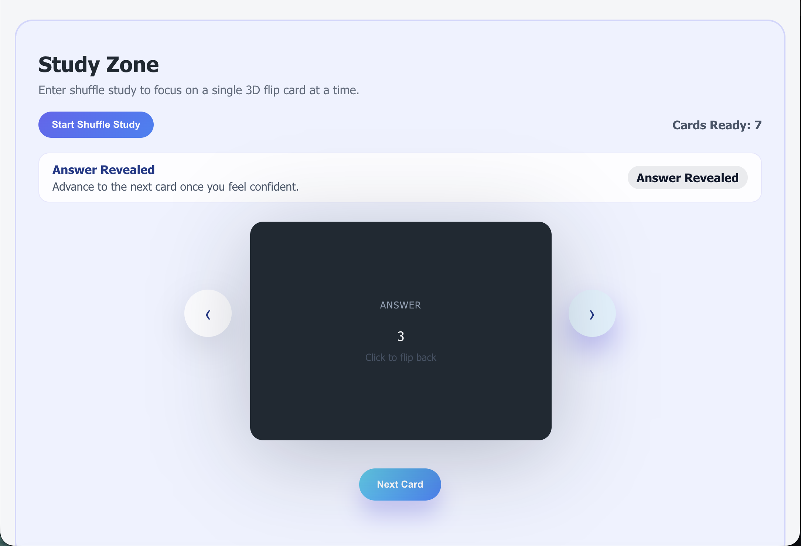
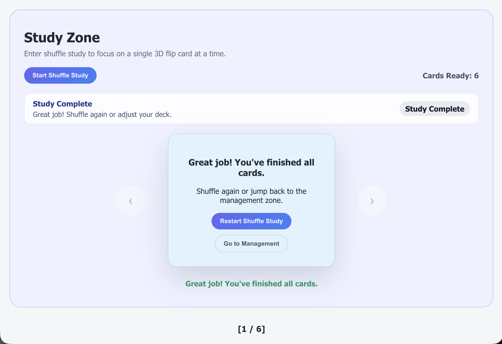

# Flashcard Control Center

---

## 1. Project Summary
This project is a single-page application (SPA) that lets learners create, manage, and study flashcards inside one dashboard. It combines a CRUD-focused management zone with a shuffle-based study flow so users can memorize content step by step.

---

## 2. Screenshots / Preview

### Management Zone


### Study Mode


### Completion State


---

## 3. Features
- Create / Read / Update / Delete flashcards
- Shuffle-based study mode with progress indicator
- 3D flip card animation (question → answer)
- Input validation on frontend and backend
- Responsive layout (desktop / mobile)
- Keyboard-accessible controls (flip via Enter/Space)
- Inline feedback (no browser alert/confirm)
- Screen-reader hints via `aria-live`

---

## 4. User Flow
1. Create flashcards in the Management Zone.
2. Edit or delete cards as content changes.
3. Start Shuffle Study from the Study Zone.
4. Flip cards to reveal answers; use CTA or keyboard to advance.
5. Complete the session and restart or return to management.

---

## 5. Technical Stack
- **Frontend:** React (Create React App)
- **Styling:** CSS
- **Backend API:** FastAPI
- **Database:** MongoDB
- **HTTP Client:** Axios

---

## 6. Folder Structure
```
flashcard-app/
├── README.md
├── backend/
│   └── main.py          # FastAPI server with CRUD + Mongo integration
└── frontend/
    └── src/
        ├── App.js       # Main React logic (state, UI, study flow)
        └── App.css      # Styling, layout, responsive rules
```

---

## 7. API Overview
| Method | Endpoint        | Description          |
|--------|-----------------|----------------------|
| GET    | `/cards`        | Fetch all flashcards |
| POST   | `/cards`        | Create new card      |
| PUT    | `/cards/{id}`   | Update a card        |
| DELETE | `/cards/{id}`   | Delete a card        |

---

## 8. Setup & Run Instructions
### Backend
```bash
cd backend
pip install -r requirements.txt  # or: pip install fastapi uvicorn motor pymongo
python3 -m uvicorn main:app --reload
```

### Frontend
```bash
cd frontend
npm install
npm start
```

---

## 9. Database / Sample Data
- MongoDB database: `flashcard_db`
- Collection: `cards`
- You can insert sample docs via `mongosh` or `mongoimport`.

---

## 10. Challenges & Solutions
- Bridging React ↔ FastAPI ↔ MongoDB while keeping ObjectId serialization safe.
- Managing multi-state UI (idle/active/revealed/complete/empty) so learners always know the next step.
- Replacing alerts/confirms with inline feedback and `aria-live` banners for accessibility.
- Designing card layout that stays responsive even for long text (max heights + scroll).
- Making `ResizeObserver` resilient while recalculating card dimensions on viewport changes.

---

## 11. Accessibility & UX Improvements
- Screen-reader labels (`aria-label`, `aria-live`, `role="status"`).
- Keyboard interactions: flip cards via Enter/Space, nav buttons always focusable.
- Focus-visible outlines for inputs/buttons; no reliance on browser alerts.
- Higher-contrast helper text and empty-state messaging.
- Responsive spacing so Management/Study zones stay readable on mobile.

---

## 12. Limitations & Future Improvements
- No authentication or user-specific decks yet.
- Study history and spaced-repetition scheduling are not implemented.
- No offline caching/export tooling.
- ResizeObserver still ties to the current card wrapper; future work could memoize to reduce reflows.

---

## 13. Files Included
- React source code (`frontend/src`)
- FastAPI backend (`backend/main.py`)
- This README

(Provide MongoDB dump or sample JSON if needed.)
